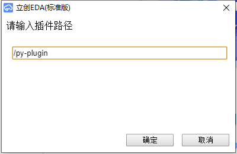

# pylceda——使用Python操作立创EDA

想要使用立创eda编辑器的API却不喜欢用js写代码？  
来试试pylceda吧，用Python调用立创eda的API~

## 使用方法
执行`pip install -r requirements.txt`安装所需的库。  
如下所示，编辑script函数，绑定路径与脚本，运行脚本服务器。  
```python
from pylceda import ScriptServer

ss=ScriptServer()

def script(api):
    result=api('getSource', {"type":'json'})
    print(result)
        
ss.bind_script("/py-plugin",script)#将脚本绑定在/py-plugin下
ss.mainloop()#启动服务
```

在立创eda中运行[pylc.js](lceda_js_plugin/pylc.js)，输入绑定的路径（默认是`/py-plugin`），点击确认即可运行相应脚本（如图）。  


## 注意事项
- api与[立创官方文档](https://docs.lceda.cn/cn/API/1-How-to-Use-API/index.html)一致。
- 暂时只支持立创eda标准版，专业版还未测试过。
- pylceda占用了用于自动布线服务的3579端口，两者功能冲突。